  

# Clone Lab

An early frontend-learning repository containing small **HTML/CSS interface recreation experiments**, including a YouTube-style page and a simple blog page.

## What is in this repository

- `youtube 2.html` — interface recreation practice
- `blog project.html` — small blog layout experiment
- `css/` — project styling
- `images/` — visual assets

## Why I keep it

This is part of my development archive. It shows the stage where I was learning how real interfaces are broken into layout, spacing, typography, and reusable visual patterns using plain HTML and CSS.

## Status

**Learning archive / early frontend practice.**

---

**Sanam Rai** · [GitHub profile](https://github.com/SanamRai001)
